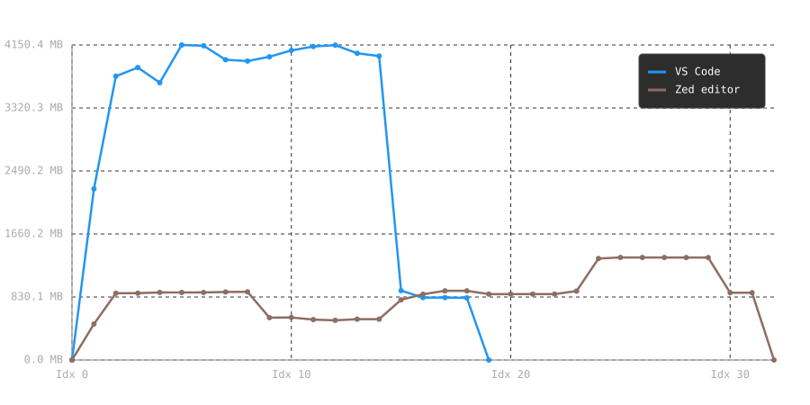

# Plotting time series data

I wrote this simple Go CLI app to plot timed series data of RAM usage of VSCode and Zed editor. Visualizing the comparison for [my blog post - check it out HERE!](https://abanoubhanna.com/posts/vscode-vs-zed/)

Here is the final comparison:

